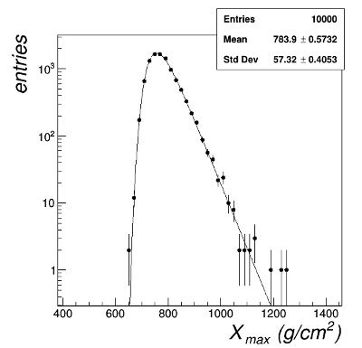

<p align="left">
  
</p>

# XmaxGumbelGenerator
A C++ software program to generate cosmic ray Xmax distributions for a given energy, mass and hadronic model based on a Gumbel model parametrization derived from CONEX simulated showers. It was developed within the Pierre Auger Observatory project and used in the Auger analysis to generate Xmax simulated data in a fast way.
It is distributed for research use only under the GNU General Public License v3.0.

## **Credits**
If you use XmaxGumbelGenerator for your research, please acknowledge it in your papers by citing the following references:

* `M. De Domenico, S. Riggi, "Reinterpreting the development of extensive air showers initiated by UHE nuclei", Pierre Auger Internal GAP Note 2012-030 (2012)`
* `M. De Domenico, M. Settimo, S. Riggi, E. Bertin, "Reinterpreting the development of extensive air showers initiated by nuclei and photons", JCAP 1307 (2013) 050`

or consider including me (`S. Riggi, INAF - Osservatorio Astrofisico di Catania, Via S. Sofia 78, I-95123, Catania, Italy`)
as a co-author on your publications.

## **Status**
This software is currently not actively maintained.

## **Installation**  

### **Prerequisites**
Install the project mandatory dependencies:  
* ROOT [https://root.cern.ch/]

Make sure you have set the following environment variables to the external library installation dirs 
* ROOTSYS: set to ROOT installation prefix

NB: Modify Makefile CPPFLAGS and LDFLAGS in case the dependency tools cannot be found.

### **Build**
To build the project:

* Clone this repository into your local $SOURCE_DIR    
  ```git clone https://github.com/PierreAugerObservatory/XmaxGumbelGenerator.git $SOURCE_DIR```    
* In the project directory type:    
  ```make```  

Binaries will be placed in the same directory.

### **Usage**
* ```XmaxGumbelGenerator [--energy=[lgE]] [--mass=[A]] [--model=[modelId]] [--nevents=[nevents]]  [--save] [--output=[path-to-outputfile]]```    
&nbsp;&nbsp;&nbsp;&nbsp;&nbsp;&nbsp;&nbsp;```--energy=[lgE] - log10(PrimaryEnergy) (default=19)```     
&nbsp;&nbsp;&nbsp;&nbsp;&nbsp;&nbsp;&nbsp;```--mass=[A] - NuclearMass (e.g. 1=proton, 4=helium, 56=Fe, etc) (default=1)```   
&nbsp;&nbsp;&nbsp;&nbsp;&nbsp;&nbsp;&nbsp;```--model=[modelId] - Hadronic model id (1=QGSJETII, 2=SIBYLL, 3=EPOS, 4=QGSJETII-04, 5=EPOS-LHC) (default=QGSJETII)```     
&nbsp;&nbsp;&nbsp;&nbsp;&nbsp;&nbsp;&nbsp;```--nevents=[nevents] - Number of generated events (default=10000)```   
&nbsp;&nbsp;&nbsp;&nbsp;&nbsp;&nbsp;&nbsp;```--output=[path-to-outputfile] -  Output file name (.root) where to store generated data```       
&nbsp;&nbsp;&nbsp;&nbsp;&nbsp;&nbsp;&nbsp;```--save - Save generated data to ROOT file without showing graphics (default=false)```    
